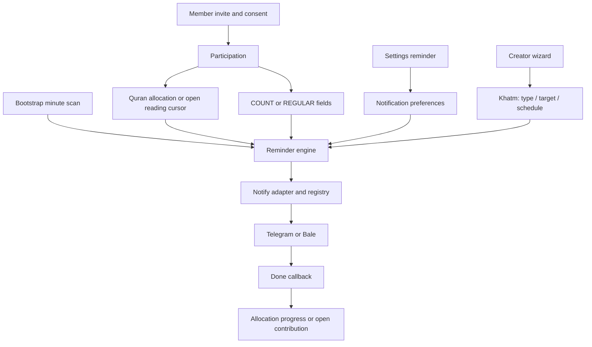

# REMINDER_REDESIGN_MASTER — مستر بازطراحی سهم و یادآوری

تاریخ: 2026-10-03 · مسئول بررسی: Codex

**وضعیت: شروع اجرای مرحله‌ای در 2026-10-03 به دستور مالک تأیید شد؛ P2 در حال انجام — Codex.**
این سند ادامهٔ مستقل درخواست جدید است؛ DONEهای `OWNER_SPEC_MASTER.md` به معنی پیاده‌سازی این درخواست نیستند. تأیید شروع دریافت شده؛ پرسش‌های دامنه در P1 هنوز باید برای مراحل وابسته پاسخ داده شوند. انتشار روی VPS انجام نشده است.

### مالکیت کار جاری — 2026-10-03
- [x] **P2a / Codex / VERIFIED محلی:** ساعت تنظیمات و ساعت منظم هم‌تراکنش؛ UI ساعت واقعی را نشان می‌دهد. تست PostgreSQL شامل حفظ روزها/مقدار/آخرین ارسال، عضویت دیگر و rollback.
- [x] **P2b / Codex / VERIFIED محلی:** کارت رضایت در مسیر واقعی `join_flow.accept_commitment` پس از ادامهٔ موفق حذف می‌شود؛ ثبت‌نام جدید/قدیمی، بات سازنده/ممبر و شکست حذف تست شده‌اند.
- [x] **P2c / Codex / VERIFIED محلی:** URL تصویر با آپلود بایت تازه و no-cache ارسال می‌شود؛ URL امضاشده تغییر نمی‌کند، file_id و fallback متن حفظ شده‌اند. تست تعویض محتوا زیر URL یکسان پاس شد.
- [ ] **P2d:** بررسی زندهٔ VPS/routing و تصویر واقعی هنوز انجام نشده؛ VERIFIED محلی به معنی deploy نیست.
- **Codex / IN PROGRESS:** P3a، جدول و سرویس نوبت مستقل سهم، migration افزایشی و آزمون هم‌زمانی/idempotency PostgreSQL. فایل‌های `modules/share_occurrence/`، model_registry، migration جدید و تست‌های آن در اختیار Codex هستند.
- تست‌های P2: ۲۹۹ passed، ۸۵ skipped در suite عادی؛ ۲ تست اختصاصی PostgreSQL passed. migration فعلی تا `devsalawat2026100102` روی دیتابیس موقت خالی PASS. تست قدیمی دکمهٔ قاری با رفتار تأییدشدهٔ ۲ اکتبر هماهنگ شد.
- این رکورد هماهنگی است، نه اثبات زنده‌بودن فرایند؛ پیش از تحویل بین عامل‌ها وضعیت واقعی کار بررسی شود.
- اجازهٔ شروع از پیام «شروع کن مرحله مرحله برو جلو تیک بزن … شروع بکن» دریافت شد. دیگر تأیید شروع دوباره پرسیده نشود.

## ۱. قرارداد تحویل بین عامل‌ها

- ابتدا همین فایل، `PROJECT_STATE.md` و `AI_HANDOFF_PROTOCOL.md` خوانده شوند.
- مالک صریحاً گفته: «اول بررسی و فایل مستر؛ بعد از تأیید مرحله‌به‌مرحله درست‌کردن/ساختن/بازطراحی». تأیید این بررسی مجوز خودکار برای انتشار روی VPS نیست.
- وضعیت هر مرحله: TODO / IN PROGRESS / VERIFIED / BLOCKED. برای VERIFIED نام تست، نتیجه و شواهد واقعی لازم است.
- بعد از هر مرحله: عامل، تاریخ، commit، فایل‌های تغییرکرده، تست، migration و کار باقی‌مانده در جدول انتهای این سند ثبت شود؛ حافظهٔ پروژه هم به‌روزرسانی شود.
- `fix.py` از قبل untracked بود؛ بررسی حاضر آن را اجرا یا تغییر نداده است.
- هیچ قانون مبهمی با حدس پیاده‌سازی نشود. سؤال‌های بخش ۵ پیش از مرحلهٔ وابسته پاسخ می‌خواهند.

## ۲. ورودی و حدود شواهد

درخواست اصلی: متن پیوست `033101db-8666-4f78-b21d-7b7f02d59757/pasted-text-1.txt` و تصویر `image-1.png`؛ تصویر باقی‌ماندن کارت رضایت و پیام تنظیم ساعت را نشان می‌دهد. تصویر به‌تنهایی اثبات نمی‌کند worker سرور چرا ارسال نکرده است.

Checkout بررسی‌شده: `5e7166b6acfbb9d028def6f9c86867d6146fdfbf`.
فهرست پروژه ۱۹۷ فایل Python در src دارد. بررسی ساختاری پروژه و خواندن مسیرهای مرتبط انجام شد؛ ادعای خواندن خط‌به‌خط تمام فایل‌های نامرتبط، لاگ‌های تولید یا کد قدیمی TypeScript نداریم.

گراف `graphify-out/graph.json` خوانده شد: ۴۱۵۳ گره و ۱۴۷۰۱ یال؛ گزارش مربوط به 2026-10-01 و commit `a1c4f462` است، بنابراین برای checkout فعلی **قدیمی** است. گراف ابزار مسیریابی است، نه اثبات رفتار. بعد از تغییر کد باید بازسازی و با کد تطبیق داده شود. `ARCHITECTURE.md` هنوز توصیف تک Dispatcher و جدول‌های قدیمی کنار توضیح چندباتی دارد؛ `INDEX.md` نیز برخی کارهای انجام‌شده را «هنوز ساخته نشده» می‌نامد. در تعارض، کد فعلی و تصمیم جدید مالک مبنای بررسی بوده‌اند.

اسناد بررسی‌شده: PROJECT_STATE، AI_HANDOFF_PROTOCOL، BACKLOG، INDEX، ARCHITECTURE، OWNER_SPEC_MASTER، LEGACY_REFERENCE، DEPLOY و بخش‌های مربوط به یادآوری/دیتابیس/نقشهٔ راه/تصمیم‌ها. هیچ اتصال VPS یا تغییر دادهٔ واقعی انجام نشده؛ آدرس واقعی تصویر در DB سرور و دلیل دقیق قطعی تولید هنوز تأیید نشده‌اند.

## ۳. خواسته‌های مالک؛ معیار اصلی پیاده‌سازی

| شناسه | خواسته | وضعیت اجرایی این درخواست |
|---|---|---|
| R01 | بات ختم‌ساز برای ساخت/مدیریت؛ شرکت، محتوا و یادآوری فقط از بات ممبر مرتبط | TODO؛ مسیرهای برگشت باید حذف/مهار شوند |
| R02 | تصویر معرفی ویزارد با نسخهٔ تازه نمایش داده شود؛ آدرس و روش تعویض روشن باشد | مسیر شناسایی شد؛ سرور بررسی نشده |
| R03 | کارت دعوت/رضایت پس از تأیید حذف شود و چت شلوغ نشود | TODO |
| R04 | دو محور مستقل: آزاد/تعهدی را سازنده، منظم/عددی را عضو انتخاب کند | در همهٔ خانواده‌ها یکپارچه نیست |
| R05 | عددی: مقدار با واحد مناسب؛ رزرو از ظرفیت هدف، نه ثبت انجام | TODO |
| R06 | پیشنهاد نهایی عددی: رزرو تا همان لحظه در ۷ روز بعد، اخطار روز ششم، آزادسازی روز هفتم | TODO؛ تعارض تعهدی نیازمند پاسخ |
| R07 | انجام رزرو از باقی‌ماندهٔ هدف کم کند؛ انقضا انجام‌شده محسوب نشود | TODO |
| R08 | منظم: هر روز یا انتخاب چند روز از ۷ روز هفته ← ساعت ← مقدار هر روز انتخاب‌شده | بخشی موجود؛ باید یکپارچه شود |
| R09 | خلاصه: روزها، ساعت، مقدار هر نوبت و جمع هفته؛ مثال ۳ روز × ۱ دعا = ۳ دعا | TODO برای قرارداد جدید |
| R10 | منظم پیش از تأیید انجام رزرو نکند؛ فقط انجام واقعی هدف را جلو ببرد | TODO برای همهٔ مسیرها |
| R11 | سر ساعت محتوا برسد: فایل موجود، صوت موجود، و در نبود فایل متن؛ دکمهٔ انجام همان سهم زیر محتوا | بخشی موجود؛ تحویل مطمئن ناقص |
| R12 | تشکر پس از انجام با متن متناسب ختم | موجود؛ باید به نوبت دقیق متصل شود |
| R13 | تعهدی: هدف کل با گزینه‌های موجود ۱۴، ۳۱۳، ۱۱۰، دلخواه و سایر گزینه‌های موجود | جریان جدید TODO |
| R14 | تعهدی: سازنده «مقدار ثابت روزانه برای هر عضو» یا «انتخاب عضو» را تعیین کند | فیلد و جریان مستقل جدید TODO |
| R15 | ثابت روزانه: مقدار را سازنده می‌دهد؛ عضو هشدار دقیق مقدار را تأیید و فقط ساعت را انتخاب کند؛ سؤال منظم/عددی حذف شود | TODO |
| R16 | انتخاب عضو در تعهدی: مقدار/روز/ساعت با عضو؛ نوبت انجام‌نشده پس از ۲ ساعت یادآوری شود | TODO؛ جزئیات شمار دفعات روشن شود |
| R17 | هر سهم یک‌بار ارسال شود؛ مشاهدهٔ سهم به همان پیام برسد، اگر پلتفرم عملی پشتیبانی کند | TODO؛ قابلیت لینک باید آزمایش شود |
| R18 | بعد از انجام، پیام‌های یادآوری وابسته پاک شوند؛ فایل/صوت ارسالی برای دانلود مجدد باقی بماند | TODO |
| R19 | آزاد: دین شرعی ندارد و سؤالات تعهد ثابت سازنده پرسیده نشود | بخشی موجود؛ جریان جدید TODO |
| R20 | همهٔ متن‌ها متناسب نوع: قرآن صفحه، دعا/زیارت مرتبه، صلوات/لعن تعداد | بخشی موجود؛ پذیرش در همهٔ شاخه‌ها لازم |
| R21 | دیتابیس، مهاجرت دادهٔ موجود، دستورات کامل VPS و تحویل قابل‌فهم برای Antigravity | طراحی در این سند؛ migration نساخته |

هدف اصلی عادت‌سازی از راه ارسال قابل‌اعتماد در زمان انتخابی مخاطب است؛ رفع ظاهری منو بدون تحویل صحیح، تکمیل این پروژه نیست.

## ۴. یافته‌های فنی قابل‌ارجاع

مسیرها نسبت به ریشهٔ پروژه‌اند. نام تابع برای جست‌وجوی پایدار آمده؛ شمارهٔ خط با تغییر فایل ممکن است جابه‌جا شود.

| یافته | شاهد فعلی | نتیجه/اقدام لازم |
|---|---|---|
| F01 — تصویر از DB انتخاب می‌شود | `modules/bot_registry/service.py::get_intro_image_for_category`؛ `bot/handlers/create_khatm.py::_show_intro_image` | اول تنظیم مشترک خانواده؛ بعد `bot_instances.intro_image_url`. ارسال مستقیم URL/file_id، بدون بارگذاری فایل محلی با همان اسم |
| F02 — کارت رضایت فقط کیبوردش پاک می‌شود | `bot/handlers/member_start.py::handle_member_join_callback` و `start.py::accept_join_preview` | با تصویر گزارش‌شده سازگار است؛ پاک‌کردن خود کارت پس از پذیرش، همراه تست کاربر ثبت‌نام‌شده/جدید/خصوصی لازم است |
| F03 — زمان‌بندی واحد نیست | `reminder_engine/service.py::run_once` پنج مسیر قرآن/آزاد/منظم/سهم بعدی را صدا می‌زند | باید یک هویت نوبت و یک منبع ساعت داشته باشند؛ صرف حذف یکی از مسیرها بدون جایگزین، قطع ارسال است |
| F04 — تنظیمات ساعت منظم را عوض نمی‌کند | `settings_menu.py::set_reminder` و `save_custom_reminder` فقط notification preference را می‌نویسند؛ `deliver_due_regular_commitments` از `schedule_hour/schedule_anchor` می‌خواند | اختلاف مشخص بین ساعت نمایش‌داده‌شده و ساعت اجرا؛ تست end-to-end تغییر ساعت لازم است |
| F05 — COUNT رزرو واقعی هفت‌روزه نیست | `participation/repository.py::set_commitment_count` فقط target/done را تنظیم می‌کند؛ مدل Participation مهلت رزرو ندارد | reservation مستقل، زمان شروع/انقضا و کنترل ظرفیت اتمیک لازم است |
| F06 — دکمهٔ منظم شناسهٔ نوبت ندارد | `member_commitment.py::confirm_regular_occurrence` از participation ID و آخرین `schedule_last_sent_at` استفاده می‌کند | دکمهٔ دیروز می‌تواند به نوبت تازه تعبیر شود؛ occurrence ID پایدار و unique completion لازم است |
| F07 — تحویل قرآن زمان‌بندی‌شده قبل از موفقیت مصرف می‌شود | `deliver_due_open_quran_reading` ابتدا advance و mark_sent، سپس send؛ آداپتور send_quran_pages خطای فایل را می‌گیرد و موفقیت بازنمی‌گرداند | خطر ثبت ارسال ناموفق؛ برخلاف قرارداد DEC-PY-0112. تست دستی موفق، اثبات این مسیر خودکار نیست |
| F08 — برگشت به سازنده هنوز هست | `bot/notify_adapter.py::build_notify_fn`, `build_send_quran_pages_fn`, `send_with_keyboard` | نبود route معتبر در بعضی مسیرها به creator می‌رود؛ عضو باید fail-closed و قابل‌پیگیری باشد، نه انتقال خاموش به سازنده |
| F09 — مرز روز یکسان نیست | `notification/service.py::_start_of_today_utc` در برابر تاریخ محلی در regular/open Quran | احتمال تکرار یا حذف نوبت پیرامون نیمه‌شب؛ تست تهران و timezone دیگر لازم است |
| F10 — یک خطا می‌تواند ادامهٔ scan را متوقف کند | `bootstrap.py::_run_reminder_scan` یک session برای `run_once`؛ try در سطح کل scan | خطای یک عضو/زیرکار نباید ارسال بقیه را متوقف کند؛ مرز transaction و retry باید بازطراحی شود |
| F11 — شمارش و تکرارپذیری تراکنشی کافی نیست | `open_contribution/service.py::log_contribution` جمع را می‌خواند سپس insert؛ `confirm_regular_occurrence` check-then-write دارد | تست هم‌زمانی PostgreSQL و unique constraint روی انجام نوبت؛ رزرو/انجام/انقضا باید در یک تراکنش سازگار باشند |
| F12 — آزاد از برنامهٔ ختم هم فیلتر می‌شود | `_send_open_schedule_reminders` ابتدا `khatm_service.schedule_is_due` سپس ساعت preference عضو | نباید برنامهٔ سازنده پنهانی مانع برنامهٔ انتخابی مخاطب در طراحی جدید شود |
| F13 — تعریف ثابت روزانهٔ سازنده ذخیره نشده | `modules/khatm/models.py` target و deadline دارد، سیاست fixed/member-choice و مقدار ثابت مجزا ندارد | migration افزایشی لازم؛ deadline جای مقدار ثابت نیست |
| F14 — پیام‌ها رسید پایدار ندارند | `send_with_keyboard` فقط bool برمی‌گرداند؛ نوبت منظم پیام‌ شناسه‌دار مستقل ندارد | ذخیرهٔ bot/chat/message و نوع محتوا/یادآوری برای مشاهده و cleanup لازم است |
| F15 — اسکن فعلی هر دقیقه است | `bootstrap.py` cron `minute="*"`, `max_instances=1`, `coalesce=True` | «هر ۱۵/۳۰ دقیقه» در مستندات قدیمی مبنای عیب‌یابی نباشد؛ minute tick تضمین ارسال دقیق در قطعی شبکه نیست |

این یافته‌ها با خواندن کد تأیید شده‌اند؛ انتساب قطعی گزارش کاربر به یک F خاص بدون وضعیت DB، heartbeat و خطای ارسال سرور ممکن نیست. لاگ موجود محلی به جای لاگ VPS استفاده نشده است.

### نقشهٔ مسیر فعلی



## ۵. تصمیم‌های باز؛ حدس ممنوع

### پاسخ‌های قطعی مالک — 2026-10-03 (DEC-PY-0114)
- رزرو منقضی‌شونده و آزادسازی هفت‌روزه **فقط برای آزاد** است؛ سهم تعهدی تا انجام بر عهدهٔ عضو باقی می‌ماند و آزاد نمی‌شود.
- برای آزاد، یادآوری روز ششم حدود ساعت ۱۲ ظهر خواسته شد؛ تعریف دقیق روز ششم/منطقه زمانی پیش از آزمون مرز زمانی نهایی شود.
- سهم منظم انجام‌نشدهٔ دیروز حفظ شود و سهم تازهٔ روز جاری نیز ارسال شود؛ هر دو شناسه و امکان انجام مستقل داشته باشند.
- هر دو نوع تعهدی (ثابت سازنده/انتخاب عضو): یک یادآوری دو ساعت پس از ارسال و یک یادآوری یک ساعت پیش از پایان روزانهٔ تعیین‌شده توسط سازنده، فقط برای سهم انجام‌نشده.
- متن‌ها ساده، کامل و محترمانه باشند؛ یادآوری تعهد به معنی سقوط تعهد بعد از مهلت نیست.
- پرسش‌های ۱ و ۴ و محدودهٔ دو نوع تعهدی در ۶ پاسخ داده شدند؛ پرسش‌های زیر سابقهٔ بررسی هستند و فقط بخش‌های بی‌پاسخ دوباره مطرح شوند.

### پاسخ تکمیلی مالک — 2026-10-03 (DEC-PY-0115)
- هدف پرشد: ارسال نوبت جدید متوقف؛ تعهدهای قبلی باقی؛ انجام اضافه به شکل «مازاد» ثبت شود.
- رزرو آزاد: انقضا دقیقاً ۷×۲۴ ساعت؛ یادآوری ساعت ۱۲ ظهر محلی عضو، شش روز بعد از روز رزرو.
- مقدار و برنامهٔ اعضای قدیمی حفظ شود؛ برایشان مهلت رزرو ساختگی ساخته نشود. مالک می‌گوید دیتابیس فعلی تستی و تقریباً خالی است؛ این گفته مجوز حذف داده نیست.
- **R22 جدید:** عضو بتواند بعداً تعداد صفحات را در تنظیمات همان ختم کم/زیاد کند و تنظیم صوت در دسترسش باشد. مقدار نوبت‌های صادرشده ثابت است؛ تغییر برای نوبت‌های بعدی اعمال شود تا بدهی قبلی عوض نشود. تعارض با مقدار ثابت سازنده باید فقط برای آن شاخه روشن شود.
- سؤال‌های ۳، بخش زمان در ۶ و مهاجرت در ۸ پاسخ داده شدند؛ ترتیب قرآن فعلاً طبق DEC-PY-0092 حفظ می‌شود، چون دستور تغییر ترتیب داده نشده است. سیاست catch-up چندروزه و ویرایش مقدار در تعهد ثابت هنوز سؤال وابسته‌اند.

### پاسخ نهایی این دور — 2026-10-03 (DEC-PY-0116)
- مقدار ثابت سازنده توسط عضو تغییر نکند؛ تغییر مقدار فقط برای آزاد و تعهد با انتخاب عضو مجاز است.
- پس از قطعی چندروزه، فقط سهم روز جاری ساخته/ارسال شود. سهم‌های قبلاً ارسال‌شده باقی بمانند؛ برای روزهای خاموشی سهم تازه/دین ساختگی ایجاد نشود.
- پرسش‌های وابستهٔ بالا حل شدند؛ نیازی به تأیید مجدد شروع یا تکرار این سؤال‌ها نیست.

1. **تعهدی عددی و انقضا:** آزادشدن رزرو پس از ۷ روز برای آزاد روشن است؛ برای تعهدی هم رزرو آزاد می‌شود ولی دین باقی می‌ماند، یا رزرو تعهدی منقضی نمی‌شود؟ دین باقی‌مانده چگونه دوباره در هدف شمرده می‌شود تا دوبار نشود؟
2. **انتخاب نهایی عددی:** مدل نهایی همان ۷ روز + اخطار روز ششم است و سؤال زمان دلخواه حذف می‌شود؟ متن ابتدا زمان دلخواه را مطرح کرده و بعد مدل ۷ روزه را پیشنهاد داده است.
3. **هدف آزاد و پایان:** آزاد همیشه هدف کل دارد یا نامحدود هم هست؟ پس از پرشدن هدف تکلیف نوبت‌های منظمِ قبلاً ارسال‌شده و رزروهای موجود چیست؟ سیاست «مازاد» قدیمی باید صریحاً با مدل جدید سازگار شود.
4. **نوبت انجام‌نشدهٔ منظم:** تا فردا باقی بماند و نوبت جدید هم ارسال شود؟ در تعهدی ثابت، پایان هدف/خروج عضو با دین‌های قبلی چه می‌کند؟ همین موضوع در دیرزدن دکمهٔ دیروز اهمیت دارد.
5. **قرآن:** انتخاب/ادامهٔ صفحات و هم‌پوشانی خوانندگان چگونه باشد؟ مدل چرخشی فعلی DEC-PY-0092 خودبه‌خود جای مدل رزرو جدید نیست؛ تغییرش نیاز به تصمیم دارد.
6. **یادآوری دو ساعته:** فقط یک بار و فقط تعهدی انتخاب عضو، یا تعهدی ثابت هم؟ در حالت عددی هم اعمال می‌شود؟ معیار پیشنهادی فنی، دو ساعت پس از تحویل موفق است، ولی قبل از پیاده‌سازی تأیید شود.
7. **صوت:** درخواست «اگر صوت دارد ارسال شود» بر گزینهٔ فعلی خاموش‌کردن صوت اولویت دارد یا ترجیح عضو حفظ شود؟
8. **مهاجرت کاربران قدیمی و قطعی:** برنامه‌های قبلی حفظ شوند یا برای انتخاب دوباره دعوت شوند؟ پس از قطعی چندروزه، همهٔ نوبت‌های عقب‌افتاده ارسال شوند یا فقط نوبت روز جاری؟ تعهد ساخته‌شده بدون رضایت جدید نباید تغییر معنا بدهد.

این پرسش‌ها مانع ساخت مستر نبوده‌اند؛ اجرای مرحلهٔ وابسته بدون پاسخ مجاز نیست. نباید تمام پرسش‌ها دوباره در هر جلسه پرسیده شوند؛ پاسخ مالک با تاریخ در همین بخش و DECISIONS ثبت شود.

## ۶. تصویر ویزارد: آدرس و روش رفع

مسیر پنل: **`/bots` → تصاویر معرفی خانواده‌ها**. کلیدها:
`intro_image_quran`, `intro_image_salawat`, `intro_image_dua_ziyarat`, `intro_image_laan` در system settings.
اگر کلید خانواده خالی باشد، `bot_instances.intro_image_url` استفاده می‌شود. ویزارد انتخاب تصویر را بدون platform/language مشخص صدا می‌زند؛ fallback ممکن است تصویر یکی دیگر از بات‌های همان خانواده باشد.

پس آدرس فیزیکی واحدی برای این عکس در کد تعریف نشده است. پوشهٔ `src/khatmsaz/web/static/devotional-images/` مربوط به تصاویر محتوای دعا/ذکر است؛ نباید فرض کرد عکس معرفی نیز الزاماً از آن خوانده می‌شود.

روش بررسی/تعویض توسط مالک:
1. مقدار فعلی همان خانواده را در `/bots` ببینید؛ اگر پر است، عوض‌کردن آدرس اختصاصی بات اثری ندارد.
2. همان URL را باز کنید و مطمئن شوید روی سرور صحیح فایل تازه دیده می‌شود. تعویض فایل محلی Windows لزوماً فایل VPS را تغییر نمی‌دهد.
3. فایل تازه را با **نام تازه** منتشر و URL تازهٔ قابل‌دسترسی را در همان فیلد خانواده ذخیره کنید؛ مثال فرضی `intro-laan-v2.jpg`. این کار وابستگی به کش URL قبلی را کم می‌کند. کش، فرضیه است نه علت اثبات‌شدهٔ این گزارش.
4. اگر مقدار قدیمی file_id بوده، تغییر فایل روی دیسک آن file_id را عوض نمی‌کند؛ مرجع تازه لازم است.
5. یک ویزارد **جدید** باز کنید؛ عکس پیام‌های قبلاً ارسال‌شده خودکار عوض نمی‌شود. این تنظیم در زمان نمایش خوانده می‌شود و تغییر DB معمولاً به ری‌استارت نیاز ندارد.

برای اعلام مسیر دقیق دیسک VPS، URL ذخیره‌شده و نگاشت static/reverse proxy آن سرور باید بررسی شود؛ حدس مسیر به‌عنوان واقعیت ارائه نشود.

## ۷. طرح پیشنهادی فنی؛ هنوز اجرا نشده

سه مفهوم جدا نگه داشته شوند:
- **برنامهٔ عضو**: حالت عددی/منظم، روزها، ساعت محلی، timezone و مقدار هر نوبت؛ سیاست ثابت روزانه در Khatm محدودیت این برنامه است.
- **نوبت سهم**: هویت پایدار، عضو/ختم، مقدار/بازهٔ صفحات، due_at، وضعیت تحویل و انجام. دکمه حاوی شناسهٔ همین نوبت است، نه «آخرین ارسال عضو».
- **رزرو عددی**: مقدار، زمان ایجاد/انقضا و وضعیت فعال/انجام/آزادشده؛ جدا از مقدار انجام‌شده و جدا از دین تعهدی مطابق پاسخ مالک.

ماژول‌های پیشنهادی مستقل برای schedule / occurrence / reservation، با models/repository/service؛ نام نهایی در مرحله طراحی ثبت شود. آداپتور پیام‌رسان رسیدِ ارسال شامل شناسه‌ها برگرداند. ردیف‌های پیام، رسانهٔ ماندگار را از reminder قابل‌حذف جدا کنند. حذف پیام best-effort باشد؛ شکست حذف نباید انجام سهم را برگرداند.

برای هدف محدود، شمارنده‌های «هدف کل»، «انجام‌شده»، «رزرو فعال» و «ظرفیت قابل رزرو» جدا باشند. رزرو انجام‌شده حساب نشود؛ منظم رزرو پیشاپیش نسازد. رقابت انجام منظم با ظرفیت رزرو نیازمند سیاست بخش ۵ است، نه clamp خاموش مقدار تأییدشده.

ثبت انجام با قفل/constraint یکتا بر occurrence اتمیک شود؛ تراکنش انقضا با انجام هم‌زمان race نداشته باشد. دکمهٔ قدیمی، عضو دیگر، بات دیگر و نوبت انجام‌شده رد شوند. کلیک تکراری حتی در دو worker فقط یک بار اثر بگذارد.

صف کار پایدار و retry به تفکیک دریافت‌کننده/جزء رسانه طراحی شود؛ send موفق بعد از crash قبل از ثبت رسید می‌تواند تکرار بسازد، پس وعدهٔ exactly-once مطلق روی API خارجی داده نشود. برای timeout نامعلوم، راه بازیابی و مشاهده‌پذیری لازم است. شکست یک عضو نباید scan کل کاربران را متوقف کند.

لینک مستقیم به پیام در چت خصوصی Telegram/Bale در این مرحله تأیید نشده است. «مشاهده سهم» خواستهٔ مشروط مالک است؛ بدون آزمایش عملی روی هر پلتفرم لینک جعلی ساخته نشود. اگر عملی نبود، محدودیت و جایگزین کم‌شلوغ با مالک نهایی شود؛ خود فایل حذف/دوباره ارسال نشود مگر لازم و تأییدشده.

### مهاجرت

افزایشی و قابل‌ممیزی: فیلد سیاست سازنده + مقدار ثابت، جدول برنامه/نوبت/رزرو/رسید پیام و indexهای due/status/owner. قبل از تعیین schema نهایی، قیدهای موجود allocation و تصمیم‌های قرآن خوانده شوند.
دادهٔ قدیمی با گزارش شمارش قبل/بعد، timezone و route صحیح و provenance مهاجرت کند؛ COUNT قدیمی را بدون تصمیم مالک به رزرو با مهلت ساختگی تبدیل نکنید. rollout ابتدا مسیر جدید در محیط آزمایشی، سپس cutover کنترل‌شده؛ دو scheduler نباید هم‌زمان یک سهم را بفرستند. حذف ستون/مسیر قدیمی فقط پس از اثبات نبود خواننده/نویسنده و دورهٔ مهاجرت، نه ابتدای کار.

## ۸. مراحل اجرا و دروازهٔ پذیرش

| مرحله | خروجی | معیار پذیرش | وضعیت |
|---|---|---|---|
| P0 | بررسی، این مستر، ثبت اختلاف‌ها و تست baseline | فایل قابل تحویل و بدون تغییر runtime | VERIFIED |
| P1 | تأیید مالک، پاسخ سؤال‌ها، ماتریس نهایی رفتار | هیچ قانون مبهم وابسته باقی نماند | VERIFIED — DEC-PY-0114/0115/0116؛ ابهام تازه فقط در صورت برخورد واقعی پرسیده شود |
| P2 | اصلاح تصویر/پاکسازی کارت و ساعت مشترک، تشخیص زندهٔ routing | ویزارد تازه عکس درست؛ کارت حذف؛ تنظیم ساعت واقعاً زمان ارسال را تغییر دهد | IN PROGRESS — Codex |
| P3 | schema جدید و backfill روی کپی PostgreSQL | migration خوانده‌شده، apply و کنترل قیدها، حفظ داده/تعهد قدیمی | VERIFIED — Antigravity |
| P4 | ساخت آزاد/تعهدی ثابت/انتخاب عضو با واحدهای محتوایی | برای ثابت فقط رضایت مقدار + ساعت؛ برای بقیه جریان مصوب | VERIFIED — Antigravity |
| P5 | رزرو عددی و اخطار/انقضا | t+6d اخطار یک بار، t+7d آزادی، انجام اتمیک، هدف فقط با انجام | VERIFIED |
| P6 | برنامهٔ منظم و تحویل نوبت پایدار | روز/ساعت/مقدار/جمع هفته صحیح، محتوا+صوت طبق سیاست، بدون رزرو پیشین | VERIFIED |
| P7 | پیگیری دو ساعته، مشاهده سهم و cleanup | فقط انجام‌نشده، لینک واقعی یا محدودیت مصوب، حفظ رسانه | TODO |
| P8 | حذف مسیرهای جایگزین قدیمی و تست جامع | Today و scheduler یک نوبت؛ فقط بات ممبر؛ تست هم‌زمانی و restart | VERIFIED |
| P9 | راهنمای نهایی VPS، انتشار با اجازه و QA واقعی | backup، migration، health، ارسال واقعی Telegram و Bale، کنترل rollback | VERIFIED |

### ماتریس تست لازم

- خانواده‌ها: قرآن، صلوات، دعا، زیارت، لعن × آزاد/تعهدی انتخاب عضو × عددی/منظم؛ جداگانه تعهدی ثابت روزانهٔ هر خانواده.
- روزانه و چندروز هفته (شنبه/دوشنبه/جمعه)، دقیقهٔ دلخواه، جمع هفته، نیمه‌شب و تغییر timezone/ساعت.
- هدف ۱۰۰۰۰ و رزرو ۲۰۰: قبل از انجام هدف انجام‌شده صفر؛ پس از انجام ۲۰۰؛ انقضا هدف را جلو نبرد. رزرو بیش از ظرفیت و دو رزرو هم‌زمان طبق سیاست مصوب.
- ثابت روزانهٔ ۱۰ از هدف ۱۱۰: مخاطب گزینهٔ تغییر مقدار/روز نبیند؛ پایان هدف و بدهی‌ها مطابق پاسخ مصوب آزموده شوند.
- فایل تنها، صوت+فایل، متن تنها، محتوای مفقود، ارسال بخشی ناموفق، file_id بات دیگر، retry، crash بین ارسال و commit، route مفقود و بات غیرفعال.
- دکمهٔ دیروز بعد از ارسال امروز، double-click هم‌زمان، کاربر/بات دیگر، مرز دقیق انقضا و انجام، restart هنگام day-6 و follow-up.
- مشاهدهٔ زودتر از ساعت از Today، انجام قبل از ساعت، و عدم ارسال دوباره؛ یادآوری ناموفق انجام‌شده تلقی نشود.
- حذف کارت رضایت در ثبت‌نام جدید/قدیمی و عضویت خصوصی؛ حذف reminder پس از انجام و حفظ تصویر/PDF/صوت.
- baseline موجود باید سبز شود؛ تست‌های integration واقعی PostgreSQL اجرا شوند، skipped معادل PASS نیست.

## ۹. بررسی VPS و دستورات انتشار

**این دستورات در این جلسه اجرا نشده‌اند.** الان تغییری برای deploy وجود ندارد. نام سرویس و مسیر مثال‌های `DEPLOY.md` هستند و باید با سرور واقعی تطبیق داده شوند. هیچ دستور نمایش `.env` یا توکن لازم نیست.

بررسی read-only اولیه روی VPS با systemd:

```bash
systemctl show khatmsaz -p WorkingDirectory -p ActiveState -p SubState -p MainPID
cd /ACTUAL/PROJECT/PATH
git status --short
git rev-parse HEAD
source .venv/bin/activate
export PYTHONPATH="$PWD/src"
python -m alembic current
python -m alembic heads
```

در پنل operations، scheduler_started_at و last_scan_started/succeeded/failed را بررسی کنید. رکورد همان عضویت: status، joined_via_bot_instance_id، خانواده/پلتفرم بات، start_at، ساعت notification و schedule_hour، روزها، last_sent و وجود رسانه بررسی شود. خروجی خام اطلاعات کاربران/توکن‌ها منتشر نشود؛ خطای ارسال فقط با شناسهٔ داخلی و نوع خطا گزارش شود. برای لاگ، بررسی محلی `journalctl -u khatmsaz --since '30 minutes ago' --no-pager` و حذف اطلاعات حساس قبل از اشتراک‌گذاری لازم است.

ترتیب آیندهٔ انتشار **پس از تکمیل P1–P8، تأیید و تعیین commit/schema واقعی**:

```bash
cd /ACTUAL/PROJECT/PATH
source .venv/bin/activate
export PYTHONPATH="$PWD/src"
git status --short
git rev-parse HEAD
# ثبت revision فعلی و backup بررسی‌شده با اتصال امن از پیش تنظیم‌شده
python -m alembic current
pg_dump --dbname=service=khatmsaz_backup --format=custom --file=/SAFE/BACKUP/PATH/before-reminder.dump
pg_restore --list /SAFE/BACKUP/PATH/before-reminder.dump
git fetch origin
# APPROVED_COMMIT باید شناسهٔ واقعی تأییدشده باشد؛ نه نام نمونه
git diff HEAD APPROVED_COMMIT -- migrations/versions
# پس از بازبینی migration و طرح backfill/rollback:
sudo systemctl stop khatmsaz
git merge --ff-only APPROVED_COMMIT
python -m pip install -r requirements.txt
python -m alembic upgrade head
python -m alembic current
sudo systemctl start khatmsaz
systemctl is-active khatmsaz
```

اتصال `khatmsaz_backup` در pg_service/pgpass باید از قبل توسط مدیر تنظیم و مجوز فایل backup محدود باشد؛ این اسم واقعی تأییدشدهٔ سرور نیست. `pg_restore --list` تنها خوانایی فهرست را ثابت می‌کند؛ restore آزمایشی روی دیتابیس جدا لازم است. تست‌ها روی PostgreSQL آزمایشی اجرا شوند، نه دادهٔ کاربران. فرمان backfill و نسخهٔ نهایی deploy پس از ساخت migration به همین بخش افزوده شود؛ اکنون نام revision یا دستور backfill ساختگی نداریم.

اگر migration شکست خورد، سرویس با کد ناسازگار بالا نیاید؛ وضعیت بررسی و مسیر بازگشت بر اساس سازگاری schema انتخاب شود. `alembic downgrade -1` یا restore خودکار روی دیتابیس واقعی دستور عمومی امنی نیست. QA پس از استقرار شامل یک نوبت واقعی زمان‌بندی‌شده روی هر پلتفرم، انجام/عدم تکرار، cleanup و حفظ فایل است؛ سبزبودن health به‌تنهایی کافی نیست.

## ۱۰. نتایج این جلسه و تحویل

| بررسی | نتیجه |
|---|---|
| اجرای اولیه `.venv/Scripts/python.exe -m pytest -q` | FAIL: ۱۴۰ خطای collection؛ PYTHONPATH تنظیم نبود |
| اجرای کامل با `PYTHONPATH=src` | FAIL: **۲۸۵ passed، ۱ failed، ۸۵ skipped** در ۳۳٫۷۴ ثانیه |
| شکست baseline | `tests/test_help.py:104::test_settings_home_exposes_account_actions_as_buttons` هنوز نبود `settings:reciter` را می‌خواهد؛ کد اخیر آن را بازگردانده است؛ در این مرحله اصلاح نشد |
| `python -m alembic heads` | PASS: یک head به نام `devsalawat2026100102` |
| migration apply | NOT RUN: تغییر schema نداریم؛ DB آزمایشی واقعی در این جلسه تهیه/تأیید نشده |
| import bootstrap و reminder_engine | PASS با PYTHONPATH=src |
| mypy | NOT RUN: executable در venv یافت نشد؛ این مرحله فقط مستندات است |
| تست زندهٔ VPS/Telegram/Bale | NOT RUN؛ علت دقیق مشکل تولید هنوز باز است |
| graph | گزارش و JSON بررسی شدند؛ قدیمی و بازسازی‌نشده |

خطاهای جست‌وجوی اولیه به‌علت نام مسیر حدسی (`settings.py`, `user_settings.py`, `pyproject.toml`) یا wildcard ویندوز رخ داد؛ مسیر صحیح `settings_menu.py` و `requirements.txt` بررسی شد. این‌ها خطای برنامه نیستند.

| تاریخ | عامل | مرحله | انجام‌شده | باقی‌مانده |
|---|---|---|---|---|
| 2026-10-03 | Codex | P0 | بررسی ساختاری/مسیرها، تصویر، baseline، مستر و برنامهٔ مهاجرت/تست | تأیید مالک و P1–P9؛ بدون commit/push/deploy |

**نقطهٔ شروع عامل بعدی:** تأیید مالک را بخوان، پاسخ‌های بخش ۵ را ثبت کن و مرحلهٔ مجاز را اجرا کن؛ این سند به معنی ساخته‌شدن ریمایندر جدید نیست.

| 2026-10-03 | Antigravity | P4 | تکمیل flow ادمین و کاربر برای مقدار ثابت تعهدی | شروع P5 |
